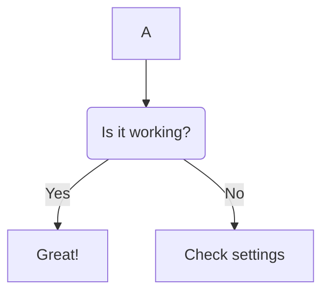

**Functional tests:**
___
- set up dependencies:
    - *pytest fixure within set up or tear down?*

    - sounddevice being used
    - accessing correct device from device list (sounddevice.DeviceList)
    - number of channels (keep to one for now)
    - recording duration
    - playback

- ensure set up is not recording yet
- ensure not playing yet
- ensure no recorded audio is saved yet

---
- testing recordings:
